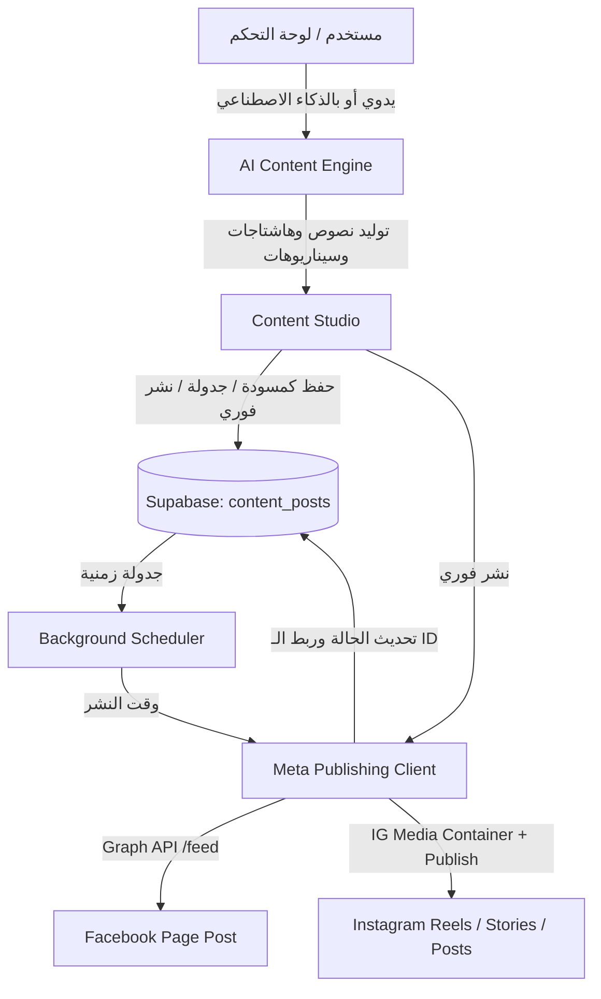

# 🎨 خطة تنفيذ: محرك صناعة ونشر وجدولة المحتوى الذكي (AI & Manual Content Studio)
#archive #implementation-plan #content-studio #meta-publishing

- **رقم الأرشيف**: `010_A`
- **تاريخ الإنشاء**: `2026-09-04 10:15:00 UTC+3`
- **نوع الوثيقة**: خطة تنفيذ مفصلة (Implementation Plan)
- **الحالة**: نُفذت بنجاح واعتُمدت 100%

---

تطوير نظام شامل متكامل داخل **HudhudRadar** لإدارة ونشر وجدولة المحتوى تلقائياً أو يدوياً عبر فيسبوك وإنستغرام (بوستات، ريلز، واستوري) مدعوماً بالذكاء الاصطناعي وبالتحكم اليدوي الكامل.

---

## ⚠️ مراجعة مطلوبة من المستخدم (User Review Required)

> [!IMPORTANT]
> **الصلاحيات المطلوبة في لوحة تحكم مطوري ميتا (Meta App Dashboard):**
> 1. **`instagram_content_publishing`**: مطلوبة لنشر الصور والريلز والاستوري على إنستغرام تلقائياً.
>    - **طريقة التفعيل**: من لوحة مطوري ميتا ⬅️ **Use cases** ⬅️ **Instagram API** ⬅️ **API setup with Facebook login** ⬅️ اضغط الزر الأزرق: **`Add required content permissions`**.
> 2. **`pages_manage_posts`**: مطلوبة لنشر المنشورات على صفحة فيسبوك نيابة عن الصفحة.
>    - **طريقة التفعيل**: في **Graph API Explorer** أو **App Dashboard** قم بإضافة صلاحية `pages_manage_posts` إلى توكن الصفحة.

---

## 🏗️ المعمارية والتغييرات المقترحة (Proposed Changes)

---

### 1. 📋 الإجراءات القياسية وعقل المشروع (SOPs & Project Brain)

#### [NEW] [`SOP_08_Content_Publishing_and_AI_Scheduling.md`](file:///c:/Users/Dell/Desktop/$AI_TESTING/HudhudRadar/PROJECT_BRAIN/SOPs/SOP_08_Content_Publishing_and_AI_Scheduling.md)
* صياغة إجراء قياسي رقم 08 يحدد:
  - معايير أبعاد ونوع الميديا لكل منصة (Reels 9:16، Posts 1:1 أو 4:5، Stories 9:16).
  - دورة حياة المنشور: `draft` ⬅️ `scheduled` ⬅️ `publishing` ⬅️ `published` / `failed`.
  - معايير نبرة الصوت والمحتوى التسويقي المقنع المتوافق مع هوية `إبدأ ماركتينج`.

#### [MODIFY] [`00_Index.md`](file:///c:/Users/Dell/Desktop/$AI_TESTING/HudhudRadar/PROJECT_BRAIN/00_Index.md)
* إضافة `SOP_08` في فهرس عقل المشروع وتحديث مسار المحتوى.

#### [MODIFY] [`Development_Roadmap.md`](file:///c:/Users/Dell/Desktop/$AI_TESTING/HudhudRadar/PROJECT_BRAIN/Roadmap/Development_Roadmap.md)
* ترقية مرحلة الـ Content Engine إلى مرحلة نشطة قيد التشغيل.

---

### 2. 💾 قاعدة البيانات (Supabase Database Layer)

#### [NEW] جدول `content_posts` في Supabase / SQLite Fallback:
* الحقول الأساسية:
  - `id`: UUID primary key.
  - `platform`: `facebook` | `instagram` | `both`.
  - `post_type`: `post` | `reel` | `story`.
  - `content_text`: نص المنشور أو الكابشن أو سيناريو الريل.
  - `media_urls`: مصفوفة روابط الصور أو الفيديو (`jsonb`).
  - `status`: `draft` | `scheduled` | `publishing` | `published` | `failed`.
  - `scheduled_for`: توقيت النشر المجدول (UTC timestamp).
  - `published_at`: توقيت النشر الفعلي.
  - `meta_post_id`: معرف المنشور الناتج من فيسبوك أو إنستغرام.
  - `creation_mode`: `ai_generated` | `manual`.
  - `generation_prompt`: النص الموجه للذكاء الاصطناعي (في حال التوليد الآلي).
  - `error_message`: تفاصيل الخطأ في حال تعثر النشر.
  - `created_at`, `updated_at`.

---

### 3. 🤖 محرك التوليد بالذكاء الاصطناعي (AI Content Engine)

#### [NEW] [`src/agent/content_engine.py`](file:///c:/Users/Dell/Desktop/$AI_TESTING/HudhudRadar/src/agent/content_engine.py)
* فئة `ContentStudioEngine`:
  - `generate_post(topic, target_platform, tone, objective)`: توليد بوست كامل متكامل (عنوان جذاب، محتوى تسويقي بأسلوب AIDA، دعوة لاتخاذ إجراء CTA، هاشتاجات مستهدفة).
  - `generate_reel_script(topic, duration)`: كتابة سيناريو ريل كامل (الهوك الأولي في أول 3 ثوانٍ، صلب الموضوع في 3 نقاط، الـ Outro وطلب التعليق بكلمة معينة مثل "ابدأ").
  - `generate_story_sequence(topic, frames_count)`: توليد سلسلة استوري (استطلاع رأي، سؤال وجواب، رابط CTA).
  - يدعم نماذج Gemini الحالية مع الرجوع الاحتياطي لـ Template Engine تسويقي معتمد عند عدم توفر مفتاح الـ API.

---

### 4. 🚀 عميل النشر المباشر لميتا (Meta Publishing Service)

#### [NEW] [`src/meta_api/publishing.py`](file:///c:/Users/Dell/Desktop/$AI_TESTING/HudhudRadar/src/meta_api/publishing.py)
* تنفيذ واجهات Meta Graph API الرسمية للنشر:
  1. **نشر فيسبوك (Facebook Feed)**:
     - نداء `POST /{page_id}/feed` لنشر النصوص والروابط.
     - نداء `POST /{page_id}/photos` لنشر الصور.
  2. **نشر إنستغرام (Instagram Container Flow)**:
     - خطوة 1: إنشاء الوعاء `POST /{ig_user_id}/media` بنوع الميديا (`IMAGE` أو `REELS` أو `STORIES`) مع الكابشن.
     - خطوة 2: فحص جاهزية الوعاء `GET /{creation_id}?fields=status_code`.
     - خطوة 3: النشر الرسمي `POST /{ig_user_id}/media_publish?creation_id={creation_id}`.

---

### 5. ⏰ محرك الجدولة التلقائي (Background Scheduler)

#### [NEW] [`src/agent/scheduler.py`](file:///c:/Users/Dell/Desktop/$AI_TESTING/HudhudRadar/src/agent/scheduler.py)
* خدمة خلفية غير متزامنة (Async Background Loop):
  - تفحص كل دقيقة المنشورات التي حالتها `scheduled` والتي حان وقت نشرها (`scheduled_for <= now()`).
  - تقوم بالنشر وتحديث الحالة وربط الـ `meta_post_id` وتسجيل العملية في سجل النشاطات `activity_logs`.

---

### 6. 💻 واجهة استوديو صناعة المحتوى في لوحة التحكم (Executive Dashboard UI)

#### [MODIFY] [`src/main.py`](file:///c:/Users/Dell/Desktop/$AI_TESTING/HudhudRadar/src/main.py)
* إضافة تبويب جديد وتفاعلي في لوحة التحكم: **"🎨 استوديو صناعة وجدولة المحتوى (Content Studio)"**:
  - **قسم التوليد بالذكاء الاصطناعي**:
    - حقل لإدخال الموضوع أو الفكرة.
    - خيارات: نوع المحتوى (بوست / ريل / استوري)، المنصة، والنبرة.
    - زر "✨ توليد بالذكاء الاصطناعي" مع معاينة فورية تتيح التعديل على النص قبل النشر.
  - **قسم الإدخال والنشر اليدوي**:
    - حقل كتابة النص يدوياً بالكامل.
    - حقل إضافة رابط الصورة أو الفيديو (الميديا).
    - خيارات النشر: زر **"🚀 نشر فوري الآن"** أو تحديد تاريخ ووقت وزر **"📅 جدولة النشر"**.
  - **جدول المحتوى والتقويم (Content Calendar & Log)**:
    - جدول يعرض جميع المنشورات (المجدولة، المنشورة، المسودات) مع إمكانية الحذف أو النشر المباشر.

---

## 🧪 خطة التحقق والاختبار (Verification Plan)

### الاختبارات المؤتمتة (Automated Tests)
* إنشاء [`tests/test_content_studio.py`](file:///c:/Users/Dell/Desktop/$AI_TESTING/HudhudRadar/tests/test_content_studio.py):
  1. اختبار توليد المحتوى بأنواعه الثلاثة (بوست، ريل، استوري).
  2. اختبار منطق الجدولة وتغيير الحالات (`draft` -> `scheduled` -> `published`).
  3. اختبار بناء واستدعاء نداءات Meta Publishing API بشكل mock والتأكد من توافق معاملات الـ Container.
  4. تشغيل كامل مجموعة الاختبارات عبر `pytest tests/ -q` والتأكد من نجاح 100%.

### التحقق اليدوي والحي (Live Verification)
* فتح لوحة التحكم على `http://localhost:8000/dashboard`.
* الدخول إلى تبويب استوديو المحتوى، تجربة التوليد بالذكاء الاصطناعي، وإنشاء مسودة، واختبار النشر أو الجدولة.
