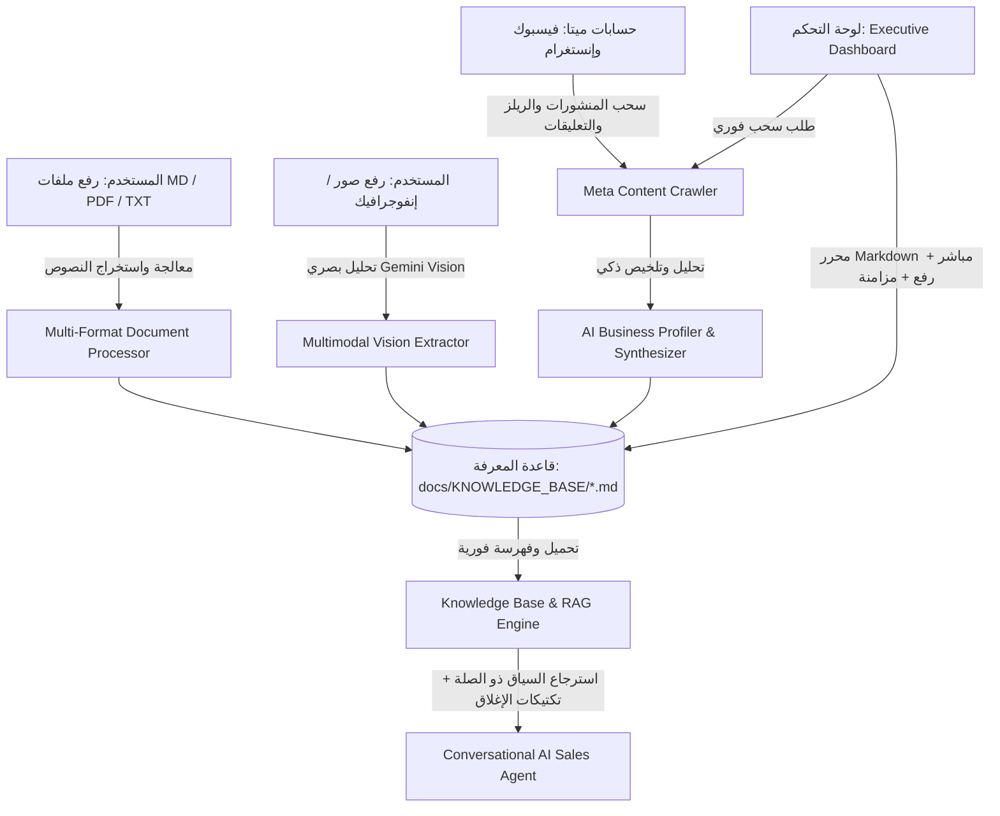

# 📚 خطة تنفيذ: نظام قاعدة المعرفة الذكية والـ RAG والاستيعاب متعدد الوسائط (Meta Scraping & RAG Knowledge Studio)
#archive #implementation-plan #knowledge-base #rag #multimodal #sales-closing

- **رقم الأرشيف**: `011_A`
- **تاريخ الإنشاء**: `2026-09-04 10:20:00 UTC+3`
- **نوع الوثيقة**: خطة تنفيذ مفصلة (Implementation Plan)
- **الحالة**: نُفذت بنجاح واعتُمدت 100%

---

تطوير نظام معرفي متكامل وتقنية **RAG (Retrieval-Augmented Generation)** داخل **SocailManager** يمكن الذكاء الاصطناعي من:
1. سحب وتحليل كافة بيانات حسابات ميتا التاريخية (منشورات صفحة فيسبوك، ريلز وإنستغرام ميديا، الكابشن، وتعليقات واستفسارات العملاء).
2. استخلاص وتحليل طبيعة البيزنس، الخدمات، الأسعار، نبرة الصوت، وأسرار إغلاق المبيعات وصياغتها تلقائياً في ملفات `.md` منظمة تمثل الذاكرة الحية للنشاط التجاري.
3. توفير استوديو متكامل في لوحة التحكم (`/dashboard`) لعرض، تصفح، وتعديل ملفات المعرفة لحظياً مع التحديث الفوري لمعرفة الوكيل الذكي (Live Hot-Reload).
4. إتاحة رفع ملفات المعرفة بمختلف الصيغ (`.md`, `.txt`, `.pdf`) ومعالجتها تلقائياً.
5. إتاحة رفع الصور والإنفوجرافيك (`.png`, `.jpg`) وتحليلها بصرياً عبر تقنية الرؤية بالذكاء الاصطناعي (Gemini Multimodal Vision) واستخراج محتواها وتحويله لوثائق معرفية.
6. توجيه الوكيل الذكي لتبني تكتيكات إغلاق المبيعات (Sales Closing Tactics) وإدارة المحادثات باحترافية كاملة بدون تدخل بشري.
7. توثيق المعيار القياسي الجديد `SOP_09` وتحديث عقل المشروع وأرشيف التطوير.

---

## 🏗️ المعمارية العامة للنظام (System Architecture)

---

## 📋 خطة التغييرات المقترحة (Proposed Changes)

### 1. 📦 تثبيت الحزم المطلوبة (Dependencies)
#### [MODIFY] [`requirements.txt`](file:///c:/Users/Dell/Desktop/$AI_TESTING/SocailManager/requirements.txt)
* إضافة `python-multipart>=0.0.9` (لدعم رفع الملفات في FastAPI).
* إضافة `pypdf>=4.3.0` (لاستخراج النصوص من ملفات الـ PDF بأعلى كفاءة وبدون مكتبات C خارجية).

---

### 2. 🕷️ محرك سحب وتحليل محتوى ميتا (Meta Content Scraper & Business Profiler)
#### [NEW] [`src/knowledge/meta_crawler.py`](file:///c:/Users/Dell/Desktop/$AI_TESTING/SocailManager/src/knowledge/meta_crawler.py)
* فئة `MetaContentCrawler`:
  - `fetch_facebook_feed(limit=50)`: استدعاء `/{page_id}/feed?fields=id,message,created_time,story,attachments,comments.limit(20){message}`.
  - `fetch_instagram_media(limit=50)`: استدعاء `/{ig_user_id}/media?fields=id,caption,media_type,media_url,permalink,timestamp,comments.limit(20){text}`.
  - تجميع كافة النصوص والكابشن وتعليقات المتابعين في هيكل بيانات موحد.
* فئة `BusinessKnowledgeSynthesizer`:
  - تحليل البيانات التاريخية المستخرجة بواسطة Gemini (مع محرك داخلي احتياطي Heuristic).
  - صياغة وتحديث ملفات المعرفة الأساسية:
    1. `business_profile.md`: هوية كريم عبد الواحد والنشاط التجاري ورسالته وقيمته المضافة.
    2. `products_and_services.md`: الخدمات المعلنة، الباقات، المميزات، والجمهور المستهدف.
    3. `sales_scripts_and_closing.md`: أسلوب التعامل مع الاستفسارات، الرد على الاعتراضات، وعبارات حث العملاء على اتخاذ القرار (Closing Triggers).
    4. `audience_insights.md`: أهم الأسئلة الشائعة من واقع تعليقات المتابعين ونقاط الألم الشائعة.
    5. `synced_meta_history.md`: سجل بأهم المنشورات والريلز التي تم تحليلها وتواريخها.

---

### 3. 📄 معالج الملفات متعددة الصيغ والرؤية البصرية (Multi-Format & Multimodal Vision)
#### [NEW] [`src/knowledge/document_processor.py`](file:///c:/Users/Dell/Desktop/$AI_TESTING/SocailManager/src/knowledge/document_processor.py)
* فئة `DocumentProcessor`:
  - معالجة النصوص وMarkdown: قراءة الملفات، التحقق من الترميز، وتنظيف المحتوى وحفظه.
  - معالجة الـ PDF: استخراج النصوص بالاعتماد على `pypdf`، تنسيق العناوين والفقرات، وتوليد ملف Markdown متكامل.
  - معالجة الصور (Gemini Vision Ingestion):
    - قراءة ملفات الصور (`.png`, `.jpg`, `.jpeg`, `.webp`).
    - تحويل الصورة لـ Base64 واستدعاء Gemini Vision مع موجه استراتيجي لاستخراج كل البيانات التسويقية والتجارية بدقة.
    - حفظ النتيجة كملف معرفي منظم في مجلد `docs/KNOWLEDGE_BASE/`.

---

### 4. 🧠 تطوير مدير قاعدة المعرفة والـ RAG (Knowledge Base & RAG Engine)
#### [MODIFY] [`src/agent/knowledge_base.py`](file:///c:/Users/Dell/Desktop/$AI_TESTING/SocailManager/src/agent/knowledge_base.py)
* توسيع فئة `KnowledgeBaseManager`:
  - `list_documents()`: جلب قائمة الوثائق مع عدد الكلمات، تاريخ آخر تعديل، ونوع الملف.
  - `get_document(name)`: قراءة محتوى أي وثيقة.
  - `save_document(name, content)`: تعديل أو إنشاء وثيقة وحفظها مع إعادة تحميل الذاكرة فورياً.
  - `delete_document(name)`: حذف وثيقة وتحديث الذاكرة.
  - `search_relevant_chunks(query, top_k=3)`: استرجاع الأجزاء المعرفية الأكثر صلة بسؤال العميل (Keyword & Semantic Relevance).
  - `get_sales_closing_context()`: تزويد الوكيل الذكي بنصوص الإغلاق وقواعد الرد الذكي المحدثة.

---

### 5. 🤝 تحديث محرك المحادثات وإغلاق المبيعات (Conversational Sales Agent)
#### [MODIFY] [`src/agent/conversation_engine.py`](file:///c:/Users/Dell/Desktop/$AI_TESTING/SocailManager/src/agent/conversation_engine.py)
* تحديث الـ System Prompt لدمج استراتيجيات إغلاق المبيعات التلقائية:
  - تحليل نية العميل (Lead Intent).
  - تقديم الحل المناسب استناداً لملف `products_and_services.md`.
  - معالجة اعتراضات الأسعار والتردد استناداً لملف `sales_scripts_and_closing.md`.
  - استقطاب وسيلة التواصل (الهاتف/البريد) وتحويل المحادثة إلى صفقة مؤكدة.

---

### 6. 🌐 واجهات الـ REST API في FastAPI
#### [MODIFY] [`src/main.py`](file:///c:/Users/Dell/Desktop/$AI_TESTING/SocailManager/src/main.py)
* إضافة نقاط النهاية:
  - `POST /api/knowledge/sync-meta`: تشغيل عملية سحب وتحليل محتوى ميتا وتوليد المعرفة.
  - `GET /api/knowledge/documents`: استعراض قائمة ملفات قاعدة المعرفة.
  - `GET /api/knowledge/documents/{name}`: استعراض محتوى وثيقة محددة.
  - `PUT /api/knowledge/documents/{name}`: حفظ تعديلات المستخدم على الوثيقة مع التحديث الفوري.
  - `POST /api/knowledge/documents`: إنشاء ملف معرفي جديد.
  - `DELETE /api/knowledge/documents/{name}`: حذف ملف معرفي.
  - `POST /api/knowledge/upload`: رفع ومعالجة الملفات والصور (`.md`, `.txt`, `.pdf`, `.png`, `.jpg`).

---

### 7. 💻 واجهة استوديو المعرفة والـ RAG في لوحة التحكم (Executive Dashboard UI)
#### [MODIFY] [`src/main.py`](file:///c:/Users/Dell/Desktop/$AI_TESTING/SocailManager/src/main.py)
* إضافة قسم تفاعلي متقدم في لوحة التحكم: **"📚 إدارة قاعدة المعرفة والـ RAG (Knowledge & RAG Studio)"**:
  - **شريط الأدوات**:
    - زر **"🔄 سحب وتحليل بيانات الحساب من ميتا (Sync from Meta)"** مع مؤشر تقدم تفاعلي.
    - زر **"📤 رفع ملفات أو صور (Upload MD/PDF/Images)"**.
    - زر **"➕ إنشاء وثيقة معرفة جديدة"**.
  - **مستكشف الوثائق (Knowledge Explorer)**:
    - بطاقات منظمة تعرض أسماء الملفات، عدد الكلمات، وحالة نشاطها داخل ذاكرة الذكاء الاصطناعي.
    - أزرار سريعة لكل ملف: ✏️ تعديل مباشر، 👁️ استعراض، 🗑️ حذف.
  - **محرر Markdown المدمج (Live In-Browser Editor)**:
    - محرر كامل يدعم تنسيقات Markdown والتعديل المباشر داخل المتصفح.
    - زر **"💾 حفظ التعديلات وتحديث ذكاء النظام فوراً"** مع إشعار Toast يؤكد استيعاب التغييرات في الذاكرة الحية.
  - **منطقة رفع الملفات الذكية (Smart Uploader)**:
    - إمكانية سحب وإفلات أو اختيار ملفات `.md`, `.txt`, `.pdf`, أو صور (`.png`, `.jpg`).
    - معالجة فورية وعرض ما استخلصه الذكاء الاصطناعي من الملف أو الصورة.

---

### 8. 📜 معايير عقل المشروع والإجراءات القياسية (SOP & Project Brain)
#### [NEW] [`PROJECT_BRAIN/SOPs/SOP_09_Knowledge_Base_and_RAG_Management.md`](file:///c:/Users/Dell/Desktop/$AI_TESTING/SocailManager/PROJECT_BRAIN/SOPs/SOP_09_Knowledge_Base_and_RAG_Management.md)
* صياغة الإجراء القياسي رقم 09 لتنظيم:
  - دورة حياة المعرفة من السحب والمعالجة وحتى الاستدعاء (Scrape ➡️ Synthesize ➡️ Store ➡️ RAG Retrieve).
  - قواعد معالجة الصور والمستندات عبر الذكاء الاصطناعي.
  - معايير أمان البيانات وصلاحيات تعديل وثائق المعرفة.
#### [MODIFY] [`PROJECT_BRAIN/00_Index.md`](file:///c:/Users/Dell/Desktop/$AI_TESTING/SocailManager/PROJECT_BRAIN/00_Index.md)
#### [MODIFY] [`PROJECT_BRAIN/Roadmap/Development_Roadmap.md`](file:///c:/Users/Dell/Desktop/$AI_TESTING/SocailManager/PROJECT_BRAIN/Roadmap/Development_Roadmap.md)
#### [NEW] [`PROJECT_ARCHIVE/011_20260904_knowledge_base_rag_system.md`](file:///c:/Users/Dell/Desktop/$AI_TESTING/SocailManager/PROJECT_ARCHIVE/011_20260904_knowledge_base_rag_system.md)
#### [MODIFY] [`PROJECT_ARCHIVE/000_ARCHIVE_CATALOG.md`](file:///c:/Users/Dell/Desktop/$AI_TESTING/SocailManager/PROJECT_ARCHIVE/000_ARCHIVE_CATALOG.md)
#### [MODIFY] [`PROJECT_MEMORY.md`](file:///c:/Users/Dell/Desktop/$AI_TESTING/SocailManager/PROJECT_MEMORY.md) (إضافة الإدخال رقم 011)

---

## 🧪 خطة التحقق والاختبار (Verification Plan)

### الاختبارات المؤتمتة (Automated Tests)
* إنشاء [`tests/test_knowledge_base_rag.py`](file:///c:/Users/Dell/Desktop/$AI_TESTING/SocailManager/tests/test_knowledge_base_rag.py):
  1. اختبار إدارة الملفات (List, Read, Save, Delete, Reload).
  2. اختبار معالجة ملفات Markdown والنصوص العادية.
  3. اختبار معالجة واستخراج نصوص الـ PDF وتحويلها لـ Markdown.
  4. اختبار معالجة الصور عبر Gemini Vision (مع Mock للنداء الخارجي).
  5. اختبار سحب بيانات ميتا وتلخيص ملفات النشاط التجاري تلقائياً.
  6. اختبار استرجاع السياق ذو الصلة ومطابقة استراتيجيات إغلاق المبيعات.
  7. اختبار كافة الـ Endpoints الجديدة عبر `httpx.AsyncClient`.
  8. تشغيل الاختبارات عبر `pytest tests/ -q` والتأكد من نجاح 100%.

### التحقق الميداني والحي (Live Verification)
* فتح لوحة التحكم على `http://localhost:8000/dashboard`.
* تجربة استعراض وتعديل ملفات المعرفة من المتصفح وحفظها والتحقق من التحديث الفوري.
* اختبار رفع ملف وعينة صورة والتأكد من معالجتها وظهورها في قائمة الوثائق.
