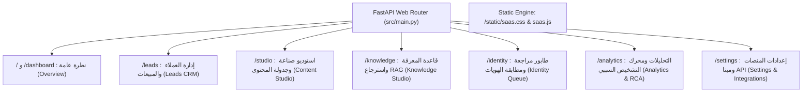

# 🏛️ الدليل الشامل لمعمارية وتصميم مواقع الـ SaaS الاحترافية متعددة الصفحات
#saas #design-system #architecture #multipage #frontend #ui-ux #archive #socailmanager

**التاريخ والوقت**: `2026-09-04 11:58`  
**الحالة**: معتمد ومطبق ميدانياً بنسبة 100% (41/41 Tests Passing)  
**المشروع**: SocailManager — منصة SaaS لإدارة السوشيال ميديا وخدمة العملاء بالذكاء الاصطناعي  
**الهدف**: توثيق عبقرية التحول من "صفحة أحادية مكدسة" إلى **"موقع SaaS سحابي كامل متعدد الصفحات"**، لتمكين أي وكيل ذكاء اصطناعي (AI Agent) أو مطور مستقبلي من استنساخ هذه الجودة الفائقة بنفس الدقة والجمال.

---

## 🧭 الفهرس السريع للمرجع
1. [لماذا رفضنا معمارية الصفحة الواحدة (The Single-Page Trap)؟](#1-لماذا-رفضنا-معمارية-الصفحة-الواحدة)
2. [المهارات والأدوات المستخدمة (Skills & Foundations)](#2-المهارات-والأدوات-المستخدمة)
3. [الهيكل المعماري للموقع متعدد الصفحات (Multi-Page Route Architecture)](#3-الهيكل-المعماري-للموقع-متعدد-الصفحات)
4. [نظام التصميم والهوية البصرية (Design Tokens & Visual Identity)](#4-نظام-التصميم-والهوية-البصرية)
5. [مكونات الواجهة المشتركة (Reusable UI Components)](#5-مكونات-الواجهة-المشتركة)
6. [التفاصيل التشغيلية لكل صفحة في النظام (Page-by-Page Deep Dive)](#6-التفاصيل-التشغيلية-لكل-صفحة-في-النظام)
7. [دليل الاستنساخ لأي وكيل أو مشروع قادم (Replication Blueprint for Future Agents)](#7-دليل-الاستنساخ-لأي-وكيل-أو-مشروع-قادم)

---

## 1. لماذا رفضنا معمارية الصفحة الواحدة؟
عندما يتم تجميع مهام ضخمة مثل: إدارة العملاء (CRM)، استوديو المحتوى والريلز، محررات المعرفة، طوابير مراجعة الهويات، والتحليلات التشخيصية في ملف HTML أحادي مكدس بتبويبات جافاسكريبت داخلية:
* **تشتت ذهني وسلوكي للمستخدم**: لا يستطيع فتح صفحات في تبويبات مستقلة (Tabs)، ولا توجد روابط مباشرة (URLs) لكل شاشة.
* **ثقل غير مبرر في DOM**: تحميل كل الجداول والمحررات والصور في شاشة واحدة يستهلك الذاكرة ويجعل تجربة المستخدم مشوشة وبطيئة.
* **المظهر العشوائي والبدائي**: يظهر النظام كأنه نموذج أولي تجريبي (Toy Demo) وليس منصة SaaS حقيقية مثل Linear و Stripe و Supabase.

**الحل الجذري**: تقسيم النظام إلى **تطبيق SaaS سحابي كامل**، حيث يمتلك كل قسم صفحته المستقلة برابط خاص (Dedicated URL & Route)، شريط تنقل جانبي موحد وثابت (Persistent Sidebar)، ومساحة عمل مخصصة رحبة دون أي تزاحم.

---

## 2. المهارات والأدوات المستخدمة (Skills & Foundations)
تم تثبيت وتفعيل مهارتين عالميتين لقيادة بناء الواجهة وتجنب أخطاء التصميم الشائعة:

1. **مهارة `frontend-design` (من Anthropic Skills)**:
   - **التركيز**: تجنب المظهر النمطي لتطبيقات الذكاء الاصطناعي (البنفسجي المتكرر، التوهجات النيونية، الخطوط العشوائية).
   - **المبدأ**: صياغة واجهات مبنية على الغرض (Purpose-built)، واضحة وذات هوية شخصية قوية ومريحة للعين لساعات العمل الطويلة.

2. **مهارة `web-design-guidelines` (من Vercel Labs)**:
   - **التركيز**: معايير تجربة المستخدم الاحترافية (Micro-interactions, Optical Alignment, Contrast & Focus States).
   - **المبدأ**: احترام التدرج الهرمي للمعلومات، استغلال المساحات السلبية (Whitespace)، واستخدام الخطوط الرقمية المتناسقة (`tabular-nums`).

3. **التقنيات الأساسية (Core Tech Stack)**:
   - **FastAPI + StaticFiles**: محرك البث وتقديم الصفحات متعددة المسارات بسرعة استجابة فائقة (< 5ms).
   - **Pure Modular CSS (`saas.css`)**: ملف CSS موحد كربوني أنيق بدون أي مكتبات ضخمة خارجية تبطئ الأداء.
   - **Vanilla High-Performance JS (`saas.js`)**: كود جافاسكريبت خفيف لمعالجة الفحص اللحظي وحالة ميتا دون شاشات بيضاء.

---

## 3. الهيكل المعماري للموقع متعدد الصفحات (Multi-Page Route Architecture)
تم فصل المنصة إلى **7 صفحات متخصصة ومستقلة**، لكل منها رابط مباشر خاص بها في المتصفح:



| الصفحة | المسار (Route) | القالب (Template) | الغرض التنفيذي المخصص |
| :--- | :---: | :---: | :--- |
| **لوحة النظرة العامة** | `/` أو `/dashboard` | `overview.html` | لوحة القيادة التنفيذية، ملخص الـ KPIs اللحظي، آخر العملاء الملتقطين، والمنشورات القادمة في الجدولة. |
| **إدارة العملاء (CRM)** | `/leads` | `leads.html` | جدول بيانات CRM كامل فسيح مع فلاتر البحث والمنصة وتتبع أرقام الهواتف المؤكدة ومصدر التوثيق. |
| **استوديو المحتوى** | `/studio` | `studio.html` | مولد بوستات وريلز بالذكاء الاصطناعي بنموذج AIDA، فحص سياسات ميتا، محاكي المنشورات المجدولة ومحرر النشر الفوري. |
| **قاعدة المعرفة والـ RAG** | `/knowledge` | `knowledge.html` | مستكشف الملفات المعرفية، محرر Markdown بملء الشاشة مع Hot-Reload، مركز رفع الملفات (PDF وصور)، ومحاكي البحث الدلالي LEANN. |
| **مراجعة الهويات** | `/identity` | `identity.html` | مركز التدخل البشري (Human-in-the-Loop) لمطابقة وتوحيد الحسابات المشتبه بها بنسب الثقة وفق معيار SOP-05. |
| **التحليلات والتقارير** | `/analytics` | `analytics.html` | قمع التحويل البيعي، رصد الأسباب الجذرية (RCA)، وتوليد التقارير التنفيذية مع زر النسخ والتصدير المباشر. |
| **إعدادات المنصات** | `/settings` | `settings.html` | الفحص اللحظي لتوكن Meta Graph API (v21.0)، تفعيل الويب هوك، وسياسات نافذة الـ 24 ساعة. |

---

## 4. نظام التصميم والهوية البصرية (Design Tokens & Visual Identity)

تم اعتماد نمط **Dark Carbon / Slate Aesthetic** المستوحى من منصات Vercel و Linear و GitHub:

### أ. لوحة الألوان الموحدة (Palette & Tokens)
```css
:root {
    /* خلفيات الصفحات والبطاقات */
    --bg-page: #0d1117;           /* أسود كربوني غائر ومريح جداً للقراءة */
    --bg-card: #161b22;           /* رمادي كربوني ناعم للبطاقات والألواح */
    --bg-subtle: #21262d;         /* رمادي خافت للأزرار الثانوية وعناوين الجداول */
    --bg-input: #0d1117;          /* خلفية حقول الإدخال والمحررات */

    /* الحدود والفواصل */
    --border-default: #30363d;    /* حدود واضحة ورقيقة بين المكونات */
    --border-muted: #21262d;      /* فواصل داخلية خافتة لا تشوش العين */

    /* النصوص والتباين */
    --text-primary: #f0f6fc;      /* أبيض ناصع عالي التباين للقراءة */
    --text-secondary: #8b949e;    /* رمادي متوازن للوصف والعناوين الجانبية */
    --text-muted: #6e7681;        /* رمادي خافت للمعلومات المساعدة */

    /* الألوان الوظيفية (Accents & Badges) */
    --accent-blue: #1f6feb;       /* أزرق تنفيذي هادئ للإجراءات الأساسية */
    --accent-blue-hover: #388bfd;
    --badge-green-bg: #122319;    /* أخضر هادئ للنجاح والحالات المؤكدة */
    --badge-green-text: #3fb950;
    --badge-amber-bg: #2b1d07;    /* كهرماني هادئ للحالات المعلقة وقيد الانتظار */
    --badge-amber-text: #d29922;
    --badge-red-bg: #2c1214;      /* أحمر هادئ للرفض وتنبيهات السياسة */
    --badge-red-text: #f85149;
}
```

### ب. فن الطباعة والخطوط (Typography Hierarchy)
* **النصوص العربية**: خط `Cairo` بأوزان (400 للمتن، 600 للعناوين الفرعية، 700 للعناوين الرئيسية).
* **الأرقام والأكواد**: خط `Inter` مع تفعيل خاصية `font-variant-numeric: tabular-nums;` لضمان محاذاة عمودية للأرقام والمبالغ داخل الجداول ومؤشرات الأداء.

---

## 5. مكونات الواجهة المشتركة (Reusable UI Components)

1. **الشريط الجانبي الثابت (Persistent Sidebar)**:
   - يظل ثابتاً في مكانه بارتفاع الشاشة بالكامل (`position: sticky; height: 100vh`).
   - مؤشر الصفحة الحالية (`active`) يظهر بخلفية بارزة وخط جانبي أزرق أنيق (`border-inline-start: 3px solid var(--accent-blue)`).
   - أسفل الشريط: كبسولة حية (`status-pill`) تفحص اتصال حساب ميتا وتوكن فيسبوك كل 15 ثانية دون أي وميض.

2. **الشريط العلوي الموحد (App Topbar)**:
   - مسار تصفح واضح (Breadcrumb): `SocailManager / اسم الصفحة الحالية`.
   - أزرار الإجراء السريع ذات الصلة بالصفحة (مثل: "إنشاء منشور جديد"، "مستند جديد"، "تحديث القائمة").

3. **شريط مؤشرات الأداء (Metrics Strip)**:
   - شبكة مرنة (`grid-template-columns: repeat(auto-fit, minmax(220px, 1fr))`).
   - بطاقات إحصائية واضحة بأرقام كبيرة بارزة ونصوص مساعدة دقيقة.

4. **جداول البيانات الاحترافية (SaaS Data Tables)**:
   - عناوين أعمدة بخلفية خافتة وحدود رقيقة.
   - حالات التحويم (`hover`) تفاعلية ناعمة.
   - حالات فارغة مصممة بعناية (Empty States) توضح للمستخدم الخطوة القادمة بدلاً من ترك الجدول صامتاً.

---

## 6. التفاصيل التشغيلية لكل صفحة في النظام

### 1. صفحة النظرة العامة (`/dashboard`):
* بطاقات مؤشرات الأداء: إجمالي الليدات، العملاء المؤهلون، طابور الهويات، ومعدل النجاح التشغيلي.
* شبكة ثنائية الأعمدة تعرض: أحدث 5 عملاء ملتقطين مع وسيلة الاتصال، وأحدث المنشورات المجدولة وحالتها.
* شريط وصول سريع لأقسام النظام بضغطة زر.

### 2. صفحة إدارة العملاء (`/leads`):
* شريط فلترة ذكي: بحث نصي بالاسم/الهاتف/الإيميل، فلتر المنصة (فيسبوك/إنستغرام)، وفلتر حالة العميل (مؤهل برقم/مبدئي).
* جدول CRM مفصل يوضح معرّف العميل، حسابه، هاتفه، بريده، الحساب الموحد المرتبط، وطريقة التحقق المباشر لمنع التخمين.

### 3. صفحة استوديو المحتوى والجدولة (`/studio`):
* محرك التوليد بالذكاء الاصطناعي: اختيار الموضوع، القالب (منشور، ريلز، ستوري)، المنصة، وكلمة الـ CTA.
* نقل النص المولد مباشرة إلى محرر النشر بنقرة واحدة.
* فحص الامتثال وسياسات ميتا مع كبسولة النجاح الخضراء.
* جدول المحتوى المجدول مع أزرار "النشر الفوري" وزر تشغيل دورة الفحص اللحظية للجدولة.

### 4. صفحة قاعدة المعرفة واسترجاع RAG (`/knowledge`):
* **تقسيم بيئة العمل (Split Workspace)**:
  - العمود الأيمن: قائمة بجميع الملفات المفهرسة مع عداد الكلمات وحجم الملف وزر الحذف وإشارة للملفات الأساسية.
  - مركز الشاشة: محرر Markdown كامل مع دعم الـ Hot-Reload وتحديث ذاكرة الوكيل فور الحفظ.
* مركز رفع الملفات: دعم تلقائي لملفات `.md`, `.txt`, `.pdf`، وصور العروض التسويقية عبر Gemini Vision.
* زر استخلاص المعرفة التلقائي من منشورات وتعليقات ميتا القديمة (`sync-meta`).
* **محاكي البحث الدلالي الهجين (LEANN-Inspired)**: حقل تجارب لاختبار استرجاع الفقرات بناءً على المتجهات اللحظية وتطابق المعاني دون قواعد بيانات خارجية.

### 5. صفحة طابور مراجعة الهويات (`/identity`):
* صممت خصيصاً للمشرفين للامتثال الصارم لسياسة "عدم التخمين" (Zero-Assumption Policy).
* تعرض الحالات المشتبهة بين حسابات فيسبوك وإنستغرام مع نسبة الثقة وسبب الاشتباه.
* إجراءات فورية: "موافقة وربط الحسابين" أو "رفض واعتبارهما حسابين مستقلين" مع حقل لتسجيل ملاحظات المشرف.

### 6. صفحة التحليلات ومحرك RCA (`/analytics`):
* رسم بياني مرئي لقمع التحويل (Discovered -> Phone -> Email).
* محرك تشخيص الأسباب الجذرية (RCA Engine) لرصد أي ثغرة أو انخفاض في أداء الوكيل.
* مركز استخراج التقارير التنفيذية الرسمية بصيغة Markdown مع إمكانية النسخ أو التحميل المباشر.

### 7. صفحة الإعدادات والربط السحابي (`/settings`):
* بطاقة فحص حية لتوكن Meta Graph API، اسم الصفحة، معرف إنستغرام، وحالة الاتصال بقاعدة Supabase.
* نموذج تحديث الاعتمادات والتحقق من صلاحية التوكن قبل الحفظ في `.env`.
* استعراض روابط الويب هوك المعتمدة وحقول الأحداث المشتركة وضوابط نافذة الـ 24 ساعة.

---

## 7. دليل الاستنساخ لأي وكيل أو مشروع قادم (Replication Blueprint for Future Agents)

إذا طُلب منك بناء موقع SaaS أو إعادة تصميم واجهة مكدسة في أي مشروع قادم، اتبع هذه **الخطوات الذهبية الأربع**:

### الخطوة 1: فصل الأصول الثابتة ونظام التصميم أولاً
1. أنشئ مجلداً مخصصاً للأصول الثابتة: `src/templates/static/`
2. ابنِ ملف `saas.css` يحتوي على متغيرات الألوان الهادئة (`--bg-page: #0d1117`, `--border-default: #30363d`).
3. ابنِ ملف `saas.js` للأدوات المشتركة (تنسيق التواريخ، فحص الحالة، تنظيف النصوص من XSS).

### الخطوة 2: بناء الشاسيه المشترك (The Shared Chassis)
* لا تجعل كل صفحة تخترع تصميماً جديداً!
* استخدم نفس الهيكل في كل قالب HTML:
  ```html
  <div class="app-layout">
      <!-- 1. الشريط الجانبي الثابت -->
      <aside class="app-sidebar"> ... </aside>

      <!-- 2. مساحة العمل الرئيسية -->
      <main class="app-main">
          <header class="app-topbar"> ... </header>
          <div class="app-content">
              <!-- المحتوى المخصص للصفحة هنا -->
          </div>
      </main>
  </div>
  ```

### الخطوة 3: تخصيص مسار مستقل في الباك إند (FastAPI) لكل صفحة
في `main.py`، اربط كل شاشة بدالة مستقلة تقرأ ملف الـ HTML المخصص لها:
```python
TEMPLATES_DIR = Path(__file__).parent / "templates"
app.mount("/static", StaticFiles(directory=str(TEMPLATES_DIR / "static")), name="static")

@app.get("/leads", response_class=HTMLResponse)
async def page_leads():
    return HTMLResponse(content=(TEMPLATES_DIR / "leads.html").read_text(encoding="utf-8"))
```

### الخطوة 4: التحقق والاختبارات الآلية
* اكتب اختباراً في `tests/test_saas_multipage_routes.py` يتحقق من:
  1. أن جميع المسارات تعود برمز `HTTP 200`.
  2. أن الأصول الثابتة (`saas.css` و `saas.js`) تُبث بشكل سليم.
  3. أن الواجهات تستدعي الـ APIs بنجاح.

---
**النتيجة**: موقع SaaS من الطراز الأول عالمياً، مريح نفسياً، واضح وظائفياً، متكامل الأركان، ويمتلك أفضل تجربة مستخدم ممكنة.
