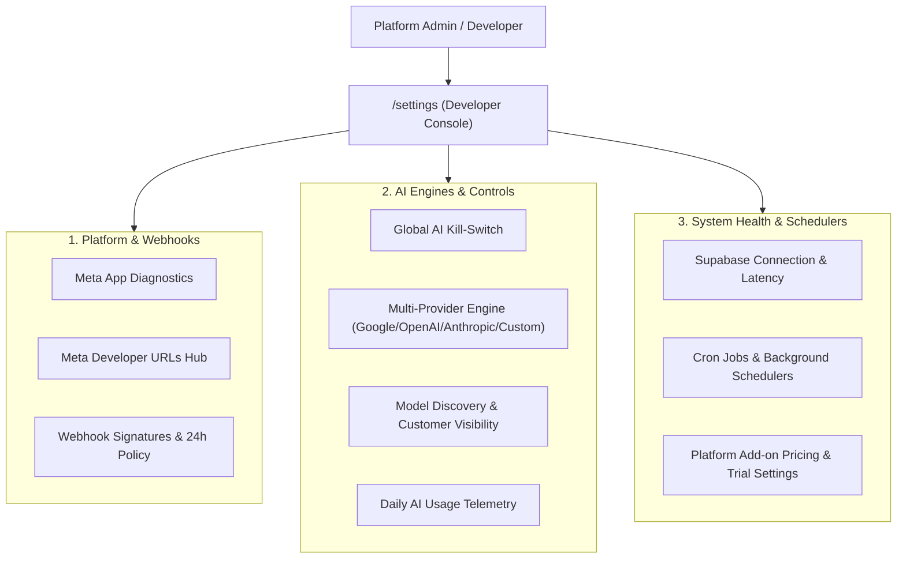

# Developer & System Core Console Architecture

**Location**: `PROJECT_BRAIN/Architecture/Dev_Console_Architecture.md`  
**Tags**: `#architecture` `#dev-console` `#admin` `#meta` `#ai-engines` `#webhooks`  
**Updated**: 2026-09-24  

---

## 1. Overview & Purpose
The **Developer Console (`/settings`)** serves strictly as the platform operator and system engineering dashboard. It is gated to `role == "admin"` through `verify_session_token`.

### Strict Separation Principle:
- **Tenant Surfaces** (`/account`, `/onboarding`): Dedicated to individual user operations (connecting their own social pages, changing their personal passwords, viewing their personal credit usage, pausing their own agent).
- **Developer Surface** (`/settings`): Dedicated to platform-wide system health, Meta App developer configurations (OAuth callback hubs, Webhook signature verification), AI provider and model management, global emergency switches, and background cron orchestration.

---

## 2. Core Subsystems

---

## 3. Data & API Contracts

| Domain | Backend Route | Purpose |
| :--- | :--- | :--- |
| **Meta Diagnostics** | `GET /api/meta/status` | Read-only app configuration status and database connection. |
| **AI Providers** | `GET /api/ai/providers` | Lists configured LLM backends with model discovery counts. |
| **Model Toggles** | `POST /api/ai/models/{id}/toggle` | Enables/disables customer access to specific models. |
| **Global AI Pause** | `GET/POST /api/ai/pause` | Manages system-wide `global_paused` emergency stop. |
| **System Alerts** | `GET /api/admin/alerts` | Health checks across Supabase, Meta, Threads, and Webhooks. |
| **Billing Catalog** | `GET/PUT /api/admin/billing/catalog` | Platform pricing for Facebook, Instagram, and Threads. |
| **Billing Settings**| `GET/PUT /api/admin/billing/settings`| Multi-platform discount rules and trial durations. |
| **Billing Reconcile**| `POST /api/admin/billing/reconcile` | Synchronizes active Polar subscriptions with local DB. |

---

## 4. References & Linked Documentation
- [[00_Index|Project Map of Content]]
- [[System_Architecture|Overall System Architecture]]
- [[Security_Model|Security & RBAC Model]]
- `PROJECT_ARCHIVE/034_20260924_implementation_plan_dev_console_restructure.md`
