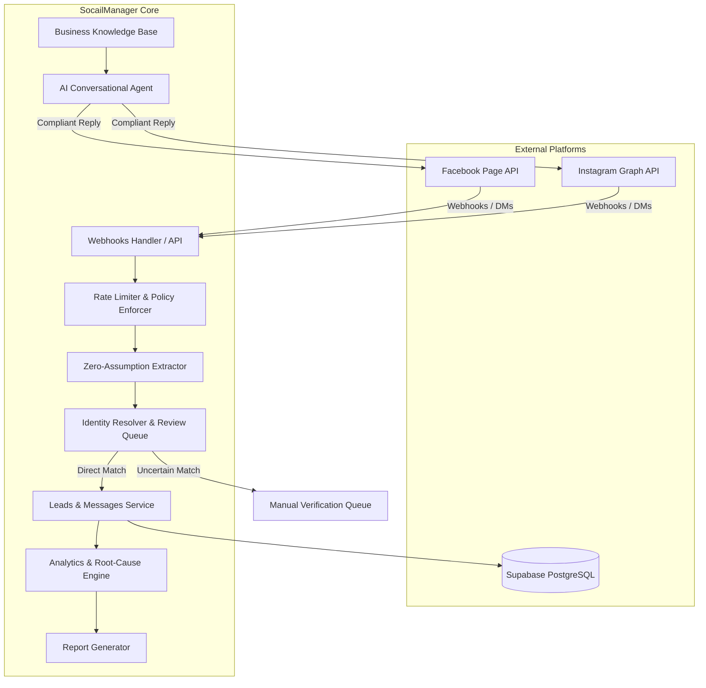

# 🏛️ System Architecture — SocailManager
#architecture #system-design #backend

نظام **SocailManager** مبني وفق نمط المعمارية الطبقية المعيارية (Modular Layered Architecture)، لضمان الفصل الواضح للمسؤوليات وسهولة الصيانة والإضافة.

---

## 📐 مخطط الطبقات والمكونات الرئيسية

---

## 🧩 المكونات التفصيلية:
1. **API & Webhook Router (`src/api/` & `src/main.py`)**:
   - استقبال أحداث Meta وتأكيد سلامة التوقيع الرقمي (`X-Hub-Signature-256`).
2. **Meta Client & Policy Enforcer (`src/meta_api/`)**:
   - الالتزام الصارم بمحددات الاستخدام (Rate Limiting) ونافذة الـ 24 ساعة للمراسلة.
3. **Data Extraction & Identity Resolution (`src/identity/`)**:
   - استخلاص الحقول المتاحة رسمياً فقط بدون اختلاق.
   - التحقق من الروابط بين حسابات فيسبوك وإنستغرام.
4. **Leads & Messages Engine (`src/leads/`)**:
   - تخزين العملاء المحتملين والرسائل في Supabase مع تتبع المنشأ الكامل (`data_provenance`).
5. **AI Agent & Knowledge Base (`src/agent/`)**:
   - قراءة المعرفة المعتمدة وتوليد ردود طبيعية وإنسانية تراعي قيود وسياسات المنصة.
6. **AI Content Studio & Scheduler (`src/content_studio/`, `src/agent/content_engine.py`, `src/agent/scheduler.py`)**:
   - توليد نصوص المنشورات وسيناريوهات الريلز وسلاسل الستوري وفق أطر تسويقية معتمدة (AIDA).
   - إدارة حالات المنشورات والجدولة التلقائية عبر عامل خلفية (`asyncio.Task`) يفحص المنشورات المستحقة دورياً كل 30 ثانية.
7. **Meta Publishing Engine (`src/meta_api/publishing.py`)**:
   - إدارة عمليات النشر عبر Meta Graph API لمنشورات فيسبوك وحاويات إنستغرام ثنائية المراحل (Reels, Stories, Posts).
8. **Analytics & Performance Engine (`src/analytics/` & `src/reporting/`)**:
   - تحليل النجاح، أسباب الفشل، إحصاءات الصفحة، ومعدلات التحويل.

