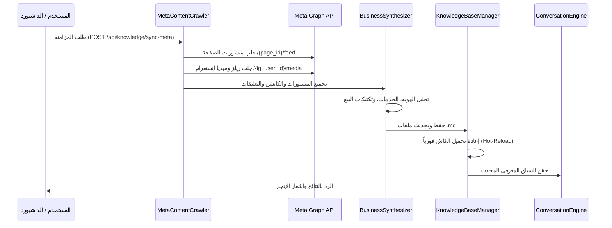

# SOP 09: إدارة قاعدة المعرفة والـ RAG والاستيعاب متعدد الوسائط
## Standard Operating Procedure: Knowledge Base, Meta Scraping, Multimodal Ingestion & RAG Sales Closing

- **المعرف (ID)**: `SOP-09`
- **التصنيف**: الذكاء الاصطناعي وهندسة المعرفة (AI & Knowledge Engineering)
- **الحالة**: نشط ومعتمد (Active & Enforced)
- **الإصدار**: 1.0.0
- **تاريخ الاعتماد**: 2026-09-04

---

### 1. الهدف والغرض (Objective & Purpose)
وضع المعايير القياسية الصارمة لكيفية استخراج، استيعاب، وفهرسة وتحديث المعرفة الخاصة بنشاط كريم عبد الواحد / إبدأ ماركتينج تلقائياً وبشكل متعدد الوسائط (Multi-Format & Multimodal Vision)، وكيفية توظيف تقنية **RAG (Retrieval-Augmented Generation)** لتوجيه الوكيل الذكي لتبني تكتيكات إغلاق المبيعات (Sales Closing Tactics) دون تدخل بشري مع إتاحة التحكم والمراجعة الفورية للمستخدم.

---

### 2. نطاق العمل والتطبيق (Scope of Applicability)
ينطبق هذا الإجراء القياسي على:
1. عمليات سحب المحتوى التاريخي من Meta Graph API (فيسبوك، إنستغرام، ريلز، وكومنتات).
2. استيعاب الملفات النصية (`.md`, `.txt`) والوثائق بصيغة `.pdf`.
3. تحليل الصور الإعلانية والإنفوجرافيك (`.png`, `.jpg`, `.webp`) عبر نماذج الرؤية البصرية (Gemini Vision).
4. الذاكرة الحية (In-Memory Hot-Reload) للمحادثات ومحرر Markdown في لوحة التحكم (`/dashboard`).
5. محرك الردود الذكية وتأهيل العملاء وإغلاق الصفقات.

---

### 3. بنية ملفات المعرفة الأساسية (Core Knowledge Architecture)
تخزن كافة المعارف المعتمدة بصيغة Markdown نظيفة وقابلة للقراءة في المسار `docs/KNOWLEDGE_BASE/`:

| اسم الملف | الغرض والمحتوى | درجة الأهمية |
| :--- | :--- | :--- |
| `business_profile.md` | هوية كريم عبد الواحد والنشاط التجاري، الرسالة، الرؤية، والقيمة المضافة التنافسية. | ركيزة أساسية (Core) |
| `products_and_services.md` | تفاصيل باقات إدارة الإعلانات الممولة، صناعة الريلز الفيروسية، واستشارات الذكاء الاصطناعي. | ركيزة أساسية (Core) |
| `sales_scripts_and_closing.md` | نصوص وتكتيكات إغلاق البيع، الرد على اعتراضات الأسعار، وطريقة حث العميل على مشاركة هاتفه. | ركيزة أساسية (Core) |
| `faqs.md` | إجابات معتمدة على الأسئلة الشائعة ونقاط الحسم للعملاء الجدد. | ركيزة أساسية (Core) |
| `brand_tone.md` | نبرة الصوت المعتمدة (ودودة، واثقة، محترفة، باللهجة المصرية الماركتينج الراقية). | ركيزة أساسية (Core) |
| `audience_insights.md` | دراسة استفسارات واهتمامات المتابعين المستخلصة من التعليقات الحقيقية. | مسحوب من ميتا |
| `synced_meta_history.md` | سجل بالمنشورات والريلز التي تم تحليلها وتواريخها وتفاعل الجمهور معها. | سجل تدقيق تاريخي |
| `visual_*.md` | وثائق مستخلصة من تحليل الصور الإعلانية بواسطة Gemini Vision. | مستندات مستوعبة |

---

### 4. دورة حياة سحب واستيعاب محتوى ميتا (Meta Ingestion Lifecycle)

---

### 5. معايير معالجة الملفات متعددة الصيغ (Multi-Format Ingestion Rules)

#### 5.1 الملفات النصية وMarkdown (`.md`, `.txt`)
- قراءة الملف بترميز `utf-8` الصريح لتجنب مشاكل الحروف العربية.
- التحقق من وجود عنوان رئيسي `#` أو إضافته تلقائياً استناداً لاسم الملف.
- تخزين الملف مباشرة في `docs/KNOWLEDGE_BASE/` وتحديث الكاش.

#### 5.2 مستندات الـ PDF (`.pdf`)
- استخراج النصوص صفحة بصفحة باستخدام مكتبة `pypdf` المعيارية.
- كتابة ترويسة توثيقية بالبيانات الوصفية (تاريخ الرفع، اسم الملف، عدد الصفحات).
- صياغة المحتوى في أقسام `## صفحة X` لضمان سهولة استرجاعه بواسطة RAG.

#### 5.3 الصور والإنفوجرافيك (`.png`, `.jpg`, `.jpeg`, `.webp`)
- تشفير بيانات الصورة بصيغة Base64 مع تحديد الـ MIME type الدقيق.
- استدعاء نموذج الرؤية البصرية `gemini-1.5-pro` بـ System Prompt استراتيجي يركز على استخراج:
  1. الخدمات والمنتجات والعروض وأي أرقام أو أسعار مذكورة.
  2. أرقام الهواتف ووسائل التواصل وروابط الحسابات.
- صياغة النتيجة في ملف `visual_{clean_name}.md` وإدراجه في قاعدة المعرفة.

---

### 6. قواعد استرجاع RAG وتكتيكات إغلاق المبيعات (Sales Closing Strategy)

> [!IMPORTANT]
> **القاعدة الذهبية للوكيل الذكي**: الذكاء الاصطناعي لا يرد لإشباع الفضول فحسب، بل يبني الثقة ويوجه المحادثة دائماً نحو **إغلاق الصفقة (Closing)**.

1. **التعامل مع استفسارات الأسعار ("بكام"، "كام السعر"، "الباقة"):**
   - يُمنع إعطاء رقم مجرد ينفر العميل أو ينهي المحادثة.
   - القاعدة: التأكيد على وجود باقات مرنة مخصصة لكل نشاط، وطلب رقم الهاتف أو الواتساب فوراً لإرسال العرض التفصيلي.
2. **التعامل مع كلمات ה-CTA في الريلز ("ابدأ"):**
   - الرد فوري وترحيبي بتقديم قيمة الخطة التسويقية، متبوعاً بطلب وسيلة التواصل للتسليم المباشر.
3. **الالتقاط التلقائي للعميل المحتمل (Lead Conversion):**
   - بمجرد رصد بريد إلكتروني أو رقم هاتف في رسالة العميل، يتم تغيير حالة العميل إلى `converted`، وتوجيه رسالة تأكيد احترافية تفيد بتواصل المستشار المختص معه.

---

### 7. التحديث اللحظي وضمانات الأمان (Hot-Reload & Safety)
1. **عدم الحاجة لإعادة تشغيل السيرفر**: أي تعديل يتم من محرر لوحة التحكم أو رفع ملف يؤدي فورياً لاستدعاء `knowledge_base.reload()` وتحديث ذاكرة الـ LLM للرسالة التالية.
2. **حماية ملفات الركائز الأساسية (Core Protection)**: يتم منع حذف ملفات الركائز الأساسية من واجهة المستخدم، بينما يُسمح بتعديل محتواها بحرية كاملة.
3. **عزل المجلدات**: يمنع حفظ أي ملفات خارج المسار المخصص `docs/KNOWLEDGE_BASE/` حماية لأمان النظام.

---

## حالة هذه النسخة ونطاقها التاريخي — 2026-09-16

هذا النص يوثق نموذج Knowledge Base القديم/المرجعي لبيزنس واحد وملفات
`docs/KNOWLEDGE_BASE/`. لا يحكم بيانات العملاء في الإنتاج متعدد المستأجرين.
للعمل الجديد في SaaS، المرجع الملزم هو
[[SOP_09_Knowledge_Base_and_RAG_Management_v2]]: المعرفة التشغيلية تخزن في
`kb_documents` و`kb_chunks` المملوكة بـ`user_id`، والاسترجاع بلا مالك يفشل
بأمان ولا يستخدم ملفات أو سياقاً عاماً.
