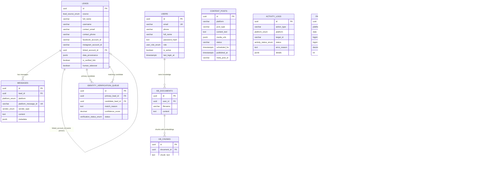

# 🗄️ Supabase Database Audit — Live Schema Report
#database #audit #security #erd
*تاريخ التدقيق: 2026-09-06 — المرحلة 2 من خارطة الطريق v2 (أرشيف 022)*

---

## 📊 ERD Diagram (Mermaid)

*(KB_DOCUMENTS/KB_CHUNKS = جداول المرحلة 5 المخطط لها — سيُنشأن مع تفعيل pgvector)*

---

## 📋 تقييم كل جدول (10 جداول حية)

| الجدول | الغرض | الحالة | ملاحظات التدقيق |
|---|---|---|---|
| `users` | المصادقة والأدوار | ✅ سليم | RLS ✓، trigger ✓، unique email ✓ — مُستخدم في الكود (auth.py) |
| `leads` | العملاء | ✅ سليم بعد الإصلاح | FK self-ref للربط ✓، provenance ✓ — كان **مكشوفاً على anon** ← أُصلح |
| `messages` | المحادثات | ✅ سليم | FK→leads CASCADE ✓، unique message id ✓ — صفر صفوف لأن الويب هوك متوقف (توكن مُبطل) |
| `identity_verification_queue` | طابور مراجعة الهويات | ✅ سليم | FKs مزدوجة ✓، قيد الثقة 0-1 ✓، unique pair ✓ — غير مستخدم بعد (طبيعي — لا حركة leads) |
| `content_posts` | المنشورات المجدولة | ✅ سليم بعد الإصلاح | index جديد (status+scheduled_for) للسكيدولر ✓ |
| `activity_logs` | سجل التدقيق | ✅ سليم | 46 سجل حي — append-only بالتصميم |
| `page_performance_metrics` | مقاييس الأداء | 🟡 صفر صفوف | السبب: توكن Meta مُبطل (code 190 — تغيير كلمة مرور) — الجدول نفسه سليم، unique (platform,date) ✓ |
| `campaigns` | حملات الإعلانات | 🟡 صفر صفوف | يستخدمه Marketing API sync (extended_api) — ينتظر إعدادات ad_account — مقبول |
| `processed_events` | منع تكرار الويب هوك | ✅ سليم | index على event_key ✓ |
| `app_settings` | إعدادات السحابة | ✅ سليم | 3 مفاتيح حية: meta_credentials, meta_cached_posts, automations_workflows |

## 🔐 الأمان — ما وُجد وأُصلح

### 🔥 الثغرة الحرجة (أُصلحت في migration 002)
**الوضع قبل الإصلاح**: دور `anon` (المفتاح العام المنتشر مع أي تطبيق) كان يملك SELECT+INSERT+UPDATE+DELETE+TRUNCATE على **كل** جداول البزنس — أي شخص يملك `SUPABASE_KEY` العام كان يستطيع قراءة بيانات العملاء PII أو **حذف كل شيء** متجاوزاً تطبيقنا بالكامل.

**الإصلاح المطبق على الحية**: `REVOKE ALL ... FROM anon` على الجداول العشرة + `REVOKE USAGE ON SCHEMA public FROM anon` — تحقق نهائي: **صفر anon grants متبقية** ✓

### سياسات RLS الحالية (نمط موحد مقصود)
جميع الجداول تستخدم `USING(true) WITH CHECK(true)` + منع anon — الحماية الفعلية طبقتين: (1) anon مُقطع تماماً، (2) التطبيق يتحقق بالمصادقة قبل أي عملية. `service_role` يتجاوز RLS بطبيعته. **هذا نمط مقصود وموثق** — ليس سهواً.

## 🔗 العلاقات والفهارس
- **4 FKs صحيحة**: messages→leads (CASCADE)، identity_queue→leads ×2 (CASCADE)، leads→leads (SET NULL)
- **28 فهرساً** — أضفنا 3 ناقصة (content_posts status+scheduled، content_posts created، messages lead+time)
- **3 triggers** صحيحة (updated_at على leads/campaigns/users)
- **pgvector مفعّل الآن** ✓ (جاهز للمرحلة 5)

## 🧹 التكرار والميت
- لا توجد جداول مكررة — `campaigns` و`page_performance_metrics` "فارغة" لكنها مبررة (منتظرة توكن Meta + إعدادات إعلانات)
- لا توجد أعمدة يتيمة غير مستخدمة
- التناقض الوحيد المكتشف سابقاً (خطأ B1 القديم) أُصلح في خارطة الطريق السابقة

## ⚠️ البند الوحيد المفتوح
`page_performance_metrics` و`messages` فارغان بسبب **توكن Meta المُبطل** (الكود 190: تغيير كلمة مرور فيسبوك) — بانتظار توليد توكن جديد من المالك. ليس عيباً هيكلياً.
