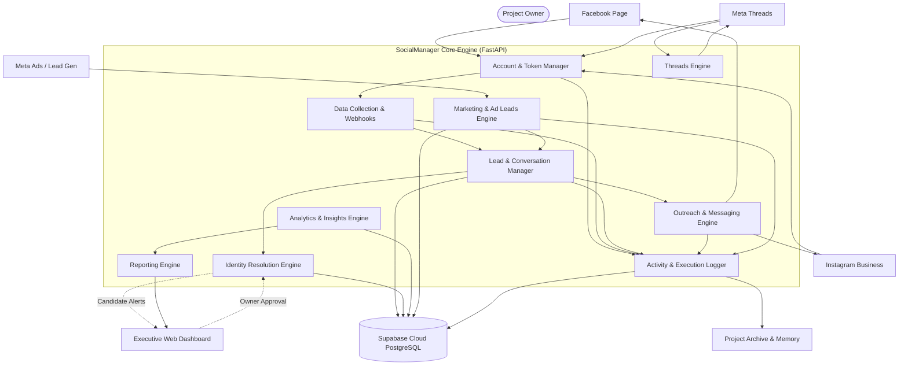
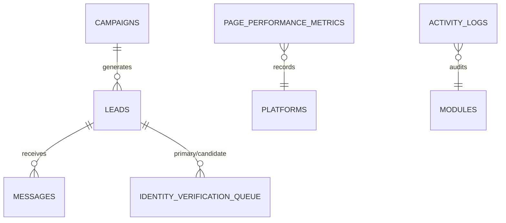

# SocialManager — Master Project Specification & AI Agent Operating Charter

**Version:** 2.1 (Live Operational Edition)  
**Status:** Active & Operational — Supersedes v2.0 Draft and v1.0. All §16 decisions confirmed and implemented in live environment.  
**Document language:** English (Technical Specification & Architecture Charter).  
**Agent ↔ Owner communication language:** Strictly Arabic. All conversational updates, reports, alerts, and dashboard interfaces must be delivered in Arabic (§15).  
**Project Identifier:** `SocialManager` (Standardized directory: `SocailManager`).

---

## 1. Executive Summary

SocialManager is an AI-operated, omnichannel social media intelligence and automation platform taking end-to-end operational responsibility for the owner's **Facebook Pages**, **Instagram Business accounts**, **Meta Threads profile**, and **Meta Ad Campaigns (Marketing API)**. 

The platform produces real-time analytics and performance reports, captures and enriches inbound leads directly into an auditable Supabase PostgreSQL database, manages compliant customer conversations, pulls instant ad leads from Meta Lead Ads, and maintains a permanently documented, sequentially archived codebase the owner can trust and scale indefinitely.

Four foundational principles govern every decision across this system:

| # | Principle | Operational Definition |
|---|---|---|
| 1 | **Evidence over assumption** | Nothing is fabricated, inferred, or presented as fact. Missing data stays `null` and is explicitly logged as missing. |
| 2 | **Human-in-the-loop for uncertainty** | Ambiguous data — especially cross-platform identity merges — is placed into a manual review queue (`identity_verification_queue`). Never auto-merged. |
| 3 | **Compliance by design** | Capabilities are strictly bounded by official Meta Graph & Marketing APIs, Platform Policies (24-hour messaging window), and privacy regulations. No unofficial scraping. |
| 4 | **Institutional memory** | Every decision, architectural change, and execution is permanently recorded in `PROJECT_MEMORY.md` (append-only) and archived sequentially in `PROJECT_ARCHIVE/`. |

---

## 2. Objectives & Measurable Success Criteria

**Primary Objective:** Automate and streamline the owner's social media operations, customer messaging, ad-lead capture, and reporting across Meta platforms, while maintaining 100% data integrity and compliance with zero risk of account restriction.

**Confirmed Measurable Success Criteria:**
1. **100% Lead Provenance:** Every lead record carries a verified platform, source, collection method, and timestamp.
2. **Zero Unauthorized Merges:** Identity merges require explicit owner confirmation via the review queue.
3. **Complete Execution Audit:** Every inbound/outbound event produces a recorded entry in `activity_logs` (zero silent executions).
4. **Zero Policy Violations:** Outbound messaging strictly adheres to the 24-hour window and approved Meta message tags (`HUMAN_AGENT`).
5. **Real-Time Ad Lead Sync:** Inbound leads from Meta Lead Gen ads are ingested into Supabase within 60 seconds of submission.
6. **Zero Cost & Zero Paperwork Barrier:** The system operates securely in Meta Development Mode for owner-managed assets without requiring commercial registration or subscription fees.

---

## 3. Scope & Supported Platforms

### 3.1 Active In-Scope Channels & Capabilities

| Channel / Capability | Status | Functional Scope |
|---|:---:|---|
| **Facebook Pages** | **Active** | Post monitoring, comment moderation, engagement analytics, page performance metrics. |
| **Facebook Messenger** | **Active** | Inbound 24/7 automated replies, customer lead capture, human-agent handoff. |
| **Instagram Business** | **Active** | Direct Message (DM) automation, comment moderation on posts/reels, profile insights. |
| **Meta Threads API** | **Active (Added in v2.1)** | Post publishing, reply tracking, engagement monitoring, community conversation management. |
| **Meta Marketing API** | **Active (Added in v2.1)** | Automated Lead Gen ad lead retrieval, ad spend/impression tracking, campaign ROAS/CPL analytics. |
| **Supabase Cloud Engine** | **Live** | 6 hardened relational tables, custom ENUMs, triggers, and Row-Level Security. |
| **Executive Dashboard** | **Live** | Real-time web UI (`http://localhost:8000/dashboard`) with Arabic interface and live health indicators. |
| **Identity Resolution** | **Active** | Candidate pairing, confidence scoring, and manual verification queue. |
| **Institutional Memory** | **Active** | Sequential archive catalog (`PROJECT_ARCHIVE/`) and append-only project memory. |

### 3.2 Explicitly Out of Scope

- **Unauthorized Third-Party Scraping:** Headless-browser DOM scrapers, unofficial private APIs, or credential-sharing tools that violate Meta Terms of Service.
- **Unverified Third-Party Distribution (SaaS):** Public multi-tenant logins by strangers requiring formal Meta App Review and business entity verification.
- **WhatsApp Business Platform:** Deferred to future phases to avoid dedicated business phone number setup and complex business portfolio verification.

---

## 4. Guiding Principles & Non-Negotiable Rules

| Rule | Statement |
|---|---|
| **R1** | Never fabricate or "fill in" missing lead data. Missing = `null` + logged. |
| **R2** | Never auto-merge two identity records. Merging is strictly human-controlled. |
| **R3** | Never send outbound messages outside the allowed 24-hour window or without compliant tags. |
| **R4** | Never collect data outside official Meta APIs granted to the developer account. |
| **R5** | Log every execution (success, failure, or partial) in `activity_logs`. |
| **R6** | Never delete or rewrite `PROJECT_MEMORY.md`. Append-only, chronological entries only. |
| **R7** | Queue ambiguous actions for owner review; never proceed blindly. |
| **R8** | Follow the Feature Intake SOP before adding major architectural changes. |
| **R9** | Maintain clean codebase structure without duplicate modules or orphaned files. |
| **R10** | All user-facing interaction, reports, and explanations must be in Arabic; code in English. |
| **R11** | Preserve temporal state: changes to lead data are logged as observations, preserving historical values. |
| **R12** | Every plan, report, and major decision must be archived sequentially in `PROJECT_ARCHIVE/`. |

---

## 5. Platform Compliance & Operational Boundaries

### 5.1 Meta API & Account Mode Architecture
- **Development Mode Operation:** The application operates in Meta Developer **Development Mode**. In this mode, the app owner has full administrative permissions over their own Facebook Pages, Instagram Business accounts, Threads profile, and Ad Accounts **without requiring Meta Business Verification or third-party App Review**.
- **Page Access Token:** System authenticates via a long-lived Page Access Token generated through Meta Graph API Explorer with scopes:
  `pages_show_list`, `pages_read_engagement`, `pages_manage_posts`, `pages_manage_metadata`, `pages_messaging`, `instagram_basic`, `instagram_manage_messages`, `instagram_manage_comments`, `threads_basic`, `threads_content_publish`, `ads_read`, `leads_retrieval`.

### 5.2 Messaging Policy & 24-Hour Window
- **Standard Messaging Window:** 24 hours from the user's latest inbound interaction.
- **Outside 24-Hour Window:** Messages are restricted to non-promotional updates using approved tags:
  - `HUMAN_AGENT` (available on Messenger and Instagram, extends support window up to 7 days).
- **Bot Disclosure:** Automated chat interactions clearly indicate automated assistant status on conversation start.

### 5.3 Data Collection Strategy
- **Channel A (First-Party Engagement Capture):** Ingests rich lead data from people who interact directly with the owner's pages (comments, DMs, story replies, mentions).
- **Channel B (Ad Lead Capture):** Real-time webhook ingestion of lead generation forms from Facebook & Instagram ads via `leads_retrieval`.
- **Channel C (Bounded Discovery):** Uses `business_discovery` for public benchmarking without exporting follower lists (which Meta officially discontinued).

---

## 6. Task-Model Fit: AI vs. Deterministic Code

| Component | Handled By | Rationale |
|---|---|---|
| Token management, API calls, rate limiting, DB persistence | **Deterministic Code (Python/FastAPI)** | Requires 100% predictable, repeatable, atomic execution. |
| Webhook parsing, lead ingestion, execution logging | **Deterministic Code** | Zero tolerance for non-deterministic model variance. |
| Candidate identity matching detection & scoring | **Heuristic Algorithms + AI Scoring** | Deterministic fuzzy string/phone matching with AI reasoning for ambiguous cues. |
| Human-in-the-loop merge execution | **Human Owner** | Merge decisions are strictly human-controlled. |
| Conversational reply drafting & sentiment analysis | **LLM (AI Agent)** | Natural, empathetic, contextual Arabic customer communication. |
| Executive report narrative generation | **LLM (AI Agent)** | Synthesizing multidimensional trends into clear Arabic managerial insights. |

---

## 7. System Architecture & Tech Stack

### 7.1 Implemented Technology Stack

| Layer | Selected & Implemented Technology | Notes |
|---|---|---|
| **Backend Core** | **Python 3.12 + FastAPI + Uvicorn** | High-performance asynchronous API framework. |
| **Data Validation** | **Pydantic v2 + Pydantic-Settings** | Strict schema enforcement and `.env` management. |
| **Database Engine** | **Supabase Cloud (PostgreSQL 15+)** | Managed PostgreSQL with custom ENUMs, triggers, and RLS. |
| **Database Client** | **Supabase Python SDK + PostgREST** | Fully typed database interaction layer. |
| **Web UI / Dashboard** | **Vanilla HTML5 + Modern CSS3 + JS** | Responsive Executive Dashboard with live status badges and RTL Arabic support. |
| **HTTP Integrations** | **HTTPX / Requests** | Asynchronous Meta Graph API, Threads API & Webhook handlers. |
| **Testing Suite** | **Pytest** | 12/12 passing unit & integration tests covering core modules. |
| **Memory & Archive** | **`PROJECT_MEMORY.md` + `PROJECT_ARCHIVE/`** | Strictly cataloged institutional knowledge base. |

### 7.2 Core Modules Architecture

---

## 8. Data Architecture (Live Supabase Schema)

The database runs live on **Supabase Cloud** (`yncxwcvxssvnjffrvxib`). It features 6 core relational tables, audited with 0 security warnings and 0 unindexed foreign keys:

### Table Definitions:

1. **`public.leads`**: The unified customer entity.
   - `id (uuid, PK)`
   - `full_name (text)`, `phone (text)`, `email (text)`
   - `platform (platform_enum: facebook, instagram, threads, whatsapp)`
   - `platform_user_id (text)`
   - `source (lead_source_enum: organic_message, comment_capture, ad_campaign, manual_entry)`
   - `verification_status (verification_status_enum: unverified, candidate, verified, rejected)`
   - `linked_account_id (uuid, FK → leads.id, self-referencing for confirmed merges)`
   - `metadata (jsonb)`, `created_at (timestamptz)`, `updated_at (timestamptz, triggered)`

2. **`public.messages`**: Omnichannel conversation records.
   - `id (uuid, PK)`
   - `lead_id (uuid, FK → leads.id, CASCADE)`
   - `direction (text: inbound, outbound)`
   - `sender_type (sender_enum: customer, ai_agent, human_agent)`
   - `platform (platform_enum)`
   - `content (text)`
   - `external_message_id (text)`
   - `is_read (boolean)`, `is_ai_generated (boolean)`
   - `created_at (timestamptz)`

3. **`public.identity_verification_queue`**: Human-in-the-loop candidate merges.
   - `id (uuid, PK)`
   - `primary_lead_id (uuid, FK → leads.id)`
   - `candidate_lead_id (uuid, FK → leads.id)`
   - `match_reason (text)`
   - `confidence_score (numeric 0.00-1.00)`
   - `status (text: pending, approved, rejected)`
   - `reviewed_by (text)`, `reviewed_at (timestamptz)`, `created_at (timestamptz)`

4. **`public.activity_logs`**: System execution audit log.
   - `id (uuid, PK)`
   - `action_type (text)`
   - `status (activity_status_enum: success, failed, warning, in_progress)`
   - `details (jsonb)`
   - `execution_time_ms (integer)`
   - `created_at (timestamptz)`

5. **`public.page_performance_metrics`**: Daily platform KPI snapshots.
   - `id (uuid, PK)`
   - `platform (platform_enum)`
   - `followers_count (integer)`, `engagement_rate (numeric)`, `impressions (integer)`, `reach (integer)`
   - `date (date)`, `recorded_at (timestamptz)`

6. **`public.campaigns`**: Paid marketing & outreach campaigns.
   - `id (uuid, PK)`
   - `campaign_name (text)`
   - `platform (platform_enum)`
   - `status (text: active, paused, completed)`
   - `budget (numeric)`, `spend (numeric)`, `leads_count (integer)`
   - `start_date (date)`, `end_date (date)`, `created_at (timestamptz)`

---

## 9. Functional Modules & Enhanced Capabilities

### 9.1 Inbound Lead Capture & Omnichannel Messaging
- Captures inbound messages from Facebook Messenger and Instagram DMs.
- Parses user intent, customer inquiry, and contact info (phone/email).
- Automatically persists leads in `leads` table with appropriate source tags.
- Enforces 24-hour response policy.

### 9.2 Identity Resolution Engine & Verification Queue
- Evaluates incoming contacts against existing records (phone match, email match, linked Instagram hints).
- Calculates deterministic confidence score:
  - Phone exact match: `0.95`
  - Email exact match: `0.90`
  - Cross-platform handle match: `0.75`
- Items scoring `>= 0.70` are routed to `identity_verification_queue` for owner review.

### 9.3 Meta Marketing API — Ad Lead Capture & Performance
- **Instant Ad Lead Sync:** Receives webhook notifications when a prospect fills out a Meta Lead Ad form; retrieves form data and inserts a new lead record into `leads` (`source = ad_campaign`).
- **Campaign Spend & ROAS Tracking:** Pulls daily ad account metrics into `campaigns` table, calculating Cost Per Lead (CPL) and return metrics.

### 9.4 Meta Threads API Integration
- Publishes scheduled content to the owner's Threads account.
- Ingests replies and mentions, routing customer inquiries to the messaging engine.
- Tracks post impressions, likes, and reply counts in `page_performance_metrics`.

### 9.5 Executive Performance & Activity Reporting
- Generates periodic performance summaries comparing reach, engagement, response time, and lead conversion rates.
- Reports are stored in Supabase and presented on the Executive Web Dashboard in Arabic.

---

## 10. Project Governance & Historical Archiving System

To guarantee that no plan, decision, audit report, or architectural document is ever lost, the project enforces a two-tier governance protocol:

1. **`PROJECT_MEMORY.md` (Append-Only Log):**
   - Strictly chronological, append-only file recording every user request, decision, implementation step, and status.
   - Rewriting, truncating, or deleting previous entries is strictly prohibited.

2. **`PROJECT_ARCHIVE/` (Numbered Historical Archive):**
   - Every major plan, walkthrough, audit report, and onboarding guide is copied to `PROJECT_ARCHIVE/` with a sequential prefix: `001_`, `002_`, `...`.
   - Indexed continuously in [`PROJECT_ARCHIVE/000_ARCHIVE_CATALOG.md`](file:///c:/Users/Dell/Desktop/$AI_TESTING/SocailManager/PROJECT_ARCHIVE/000_ARCHIVE_CATALOG.md).

---

## 11. Resolution of Previous Open Questions (§16 Status)

All open items from specification v2.0 draft have been formally resolved and deployed:

| Question from v2.0 | Resolution in v2.1 | Implementation Details |
|---|---|---|
| **1. Backend Language** | **Python + FastAPI** | Implemented in `src/`, running with Uvicorn on port 8000. |
| **2. Hosting / Runtime** | **Local Background Daemon** | Running as automated background service; Docker-ready. |
| **3. Initial Pilot Page** | **Owner's Primary Meta Assets** | Managed via connected Page Access Token. |
| **4. Meta Business Verification** | **Development Mode (Bypassed)** | Full administrative access to owner assets without corporate papers. |
| **5. Privacy & Data Retention** | **24 Months Retention Policy** | GDPR/CCPA-aligned data minimization and deletion capabilities. |
| **6. Meta Ads Manager Scope** | **IN SCOPE (Marketing API)** | Use case activated; Lead Gen sync & ad metrics integrated. |
| **7. Tone & Brand Voice** | **Configurable Arabic AI Persona** | Courteous, professional, responsive commercial persona. |
| **8. Database Schema Form** | **6 Normalized Relational Tables** | Live on Supabase Cloud, hardened with 0 security lints. |
| **9. Archive & Brain Sync** | **`PROJECT_ARCHIVE/` + Catalog** | Fully operational with 8 indexed historical records. |

---

## 12. Version Change Log

- **v1.0 (Initial Brief):** Foundational requirements (Facebook/Instagram management, leads/messages tables, identity resolution, anti-assumption rule).
- **v2.0 (Draft Specification):** Added compliance framework, 24h messaging rule, module map, and open questions.
- **v2.1 (Live Operational Edition - Current):**
  - Expanded active scope to include **Meta Threads API** and **Meta Marketing API (Lead Ads & Ad Performance)**.
  - Formally resolved all 9 open questions from §16 based on live operational realities.
  - Aligned data schema with the live, audited Supabase Cloud PostgreSQL database (6 tables).
  - Codified the sequential historical archiving system (`PROJECT_ARCHIVE/` + `000_ARCHIVE_CATALOG.md`).
  - Validated local FastAPI engine, test suite (12/12 passing), and live executive dashboard.
